# Artisan Finder 🔧
A two-sided marketplace app built with Flutter and Firebase that connects customers with skilled artisans (plumbers, electricians, painters, carpenters, and AC technicians) in Lagos, Nigeria.

---

## Screenshots

  
  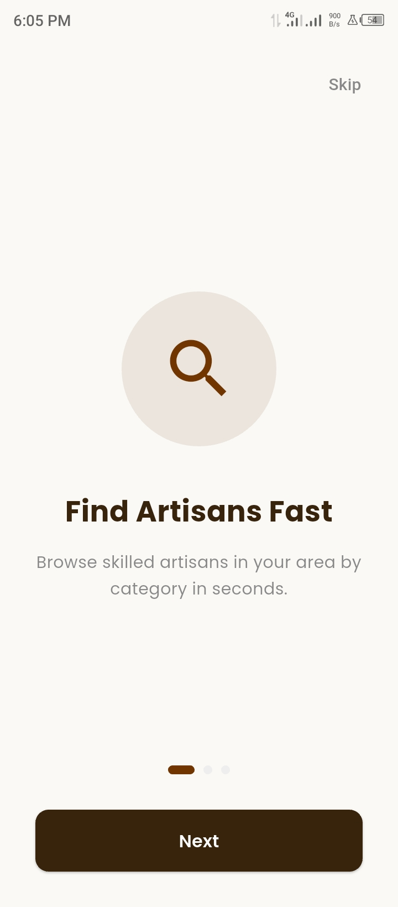
  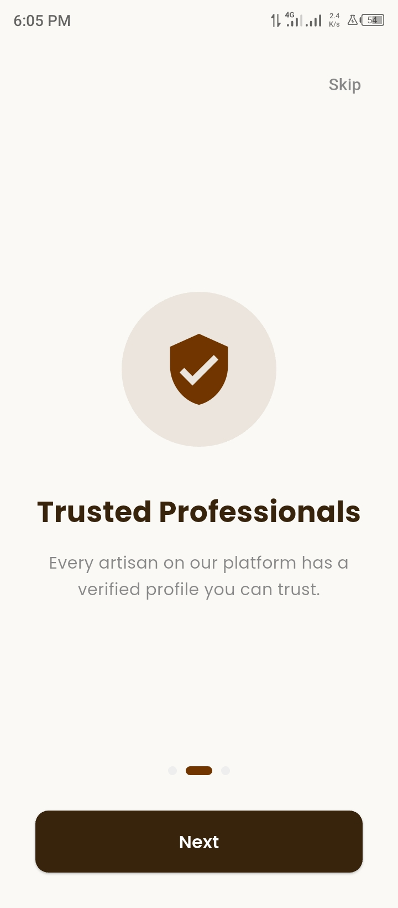
  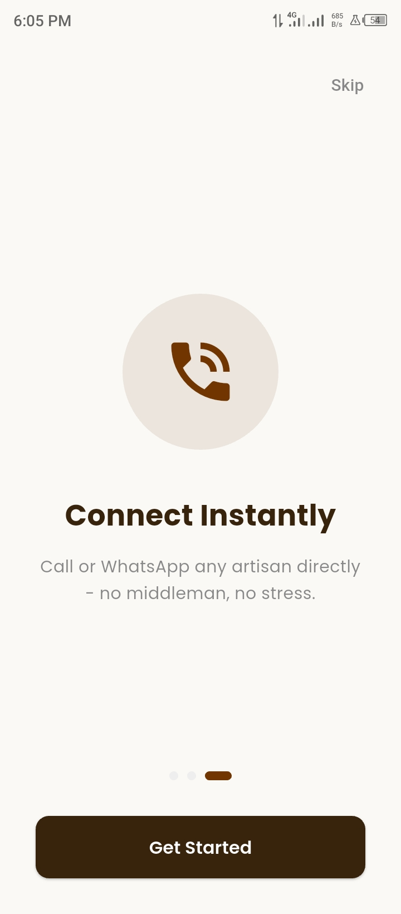
  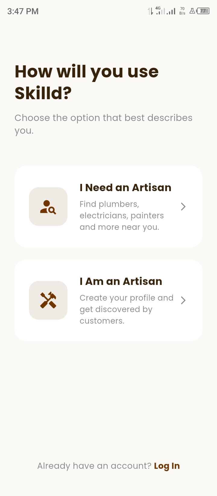
  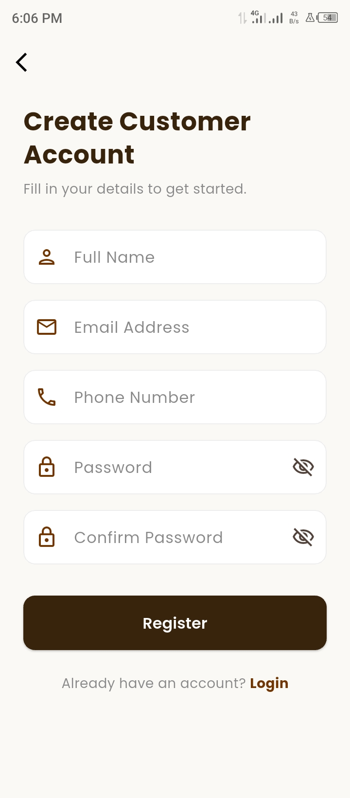
  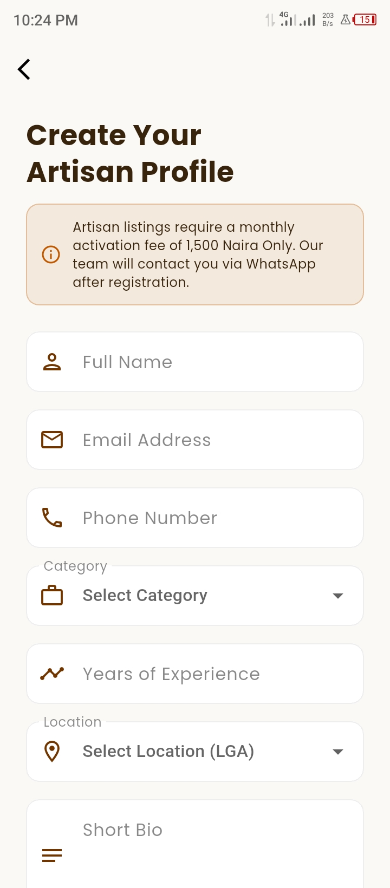
  
  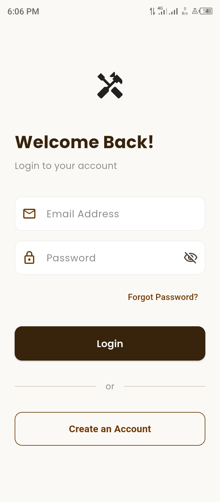
  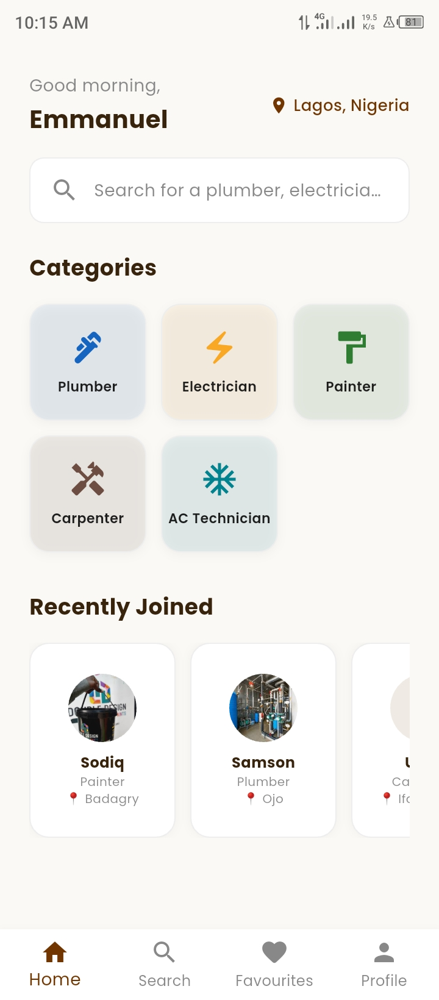
  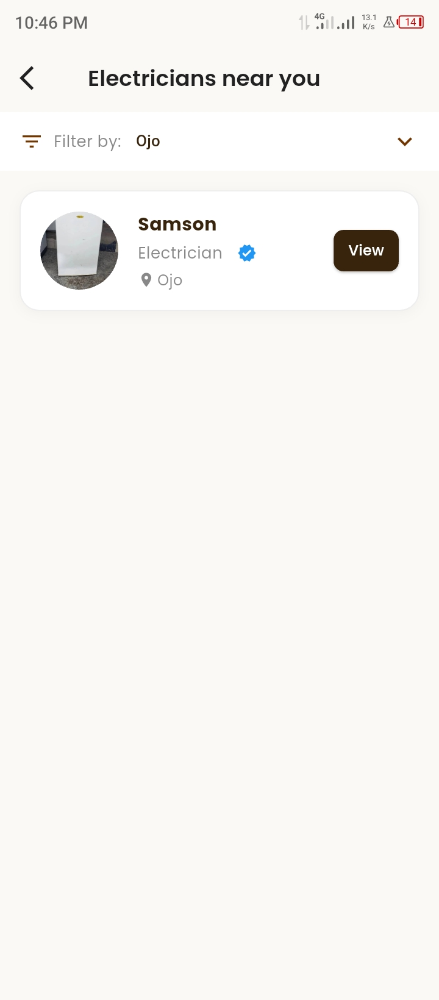
  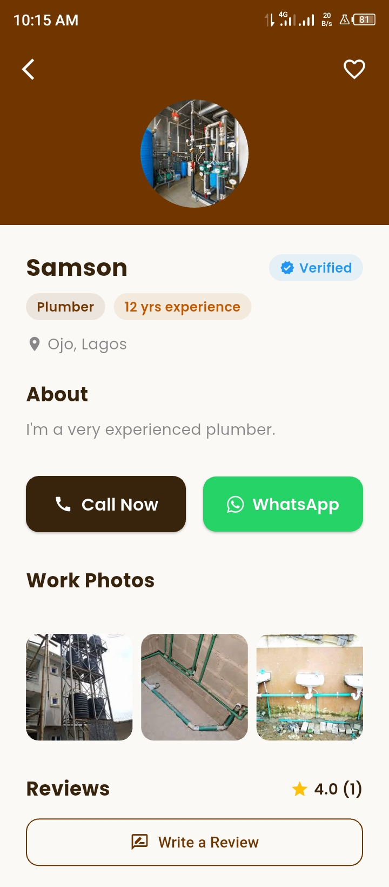
  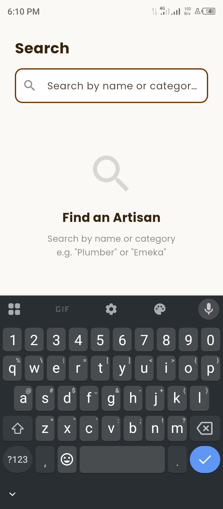
  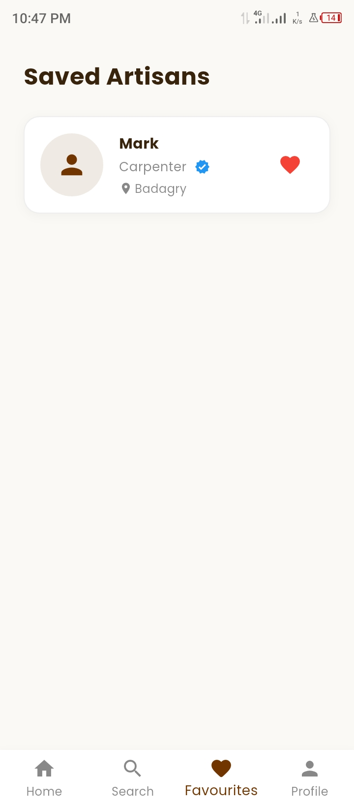
  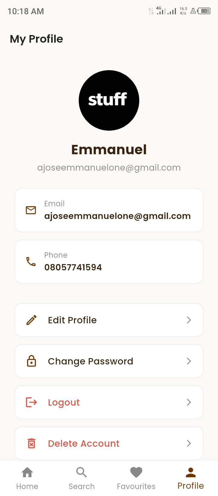
  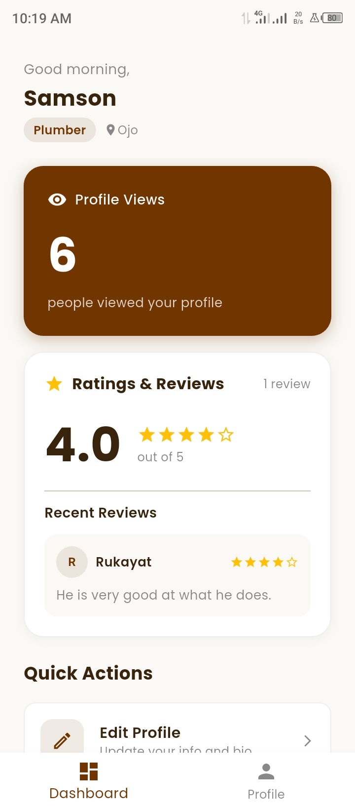
  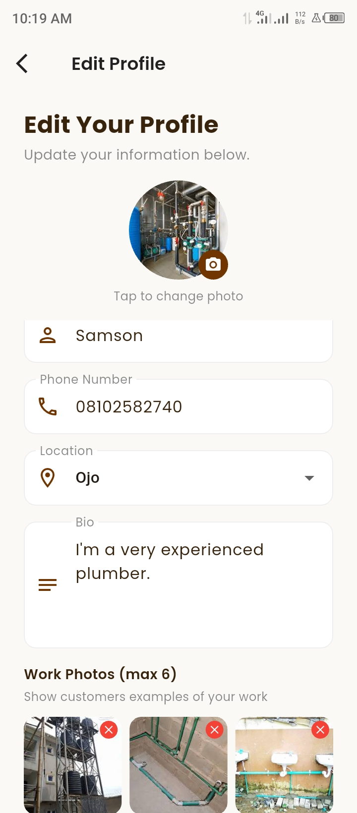

---

## Features

### Customer Side
- 🔐 **Authentication** — Register, login, email verification and forgot password via Firebase Auth
- 🏠 **Home Screen** — Browse artisan categories and recently joined artisans
- 🔍 **Search** — Search artisans by name or category in real time
- 📋 **Artisan List** — Browse artisans by category with location filter
- 👤 **Artisan Profile** — View full artisan profile with bio, experience and location
- 📞 **Direct Contact** — Call or WhatsApp any artisan directly with one tap
- ❤️ **Save Artisans** — Save favourite artisans for quick access later
- ✏️ **Edit Profile** — Update name, phone number and profile photo
- 🔒 **Change Password** — Securely update account password
- 🗑️ **Delete Account** — Permanently delete account and all associated data

### Artisan Side
- 📝 **Registration** — Register with full profile including category, experience, location and bio
- ⏳ **Pending Activation** — Profile reviewed and activated by admin within 24 hours
- 📊 **Dashboard** — View real time profile view count
- ✏️ **Edit Profile** — Update bio, location, phone and profile photo
- 🗑️ **Delete Account** — Permanently delete account and all associated data

### General
- 🖼️ **Profile Photos** — Upload and update profile photos via Cloudinary
- 💾 **Persistent Login** — Stay logged in across app restarts
- 🎨 **Custom Theme** — Unique Chocolate Truffle color palette
- 📱 **Smooth Onboarding** — 3 slide onboarding experience for new users

---

## Built With
- [Flutter](https://flutter.dev/) — UI framework
- [Firebase Authentication](https://firebase.google.com/products/auth) — User login and registration
- [Cloud Firestore](https://firebase.google.com/products/firestore) — Cloud database
- [Flutter Riverpod](https://riverpod.dev/) — State management
- [Cloudinary](https://cloudinary.com/) — Profile photo hosting
- [url_launcher](https://pub.dev/packages/url_launcher) — Call and WhatsApp integration
- [image_picker](https://pub.dev/packages/image_picker) — Profile photo selection
- [shared_preferences](https://pub.dev/packages/shared_preferences) — Persistent login and onboarding state
- [font_awesome_flutter](https://pub.dev/packages/font_awesome_flutter) — WhatsApp icon
- [google_fonts](https://pub.dev/packages/google_fonts) — Poppins typography

---

## Architecture
- **Pattern:** Feature-based folder structure
- **State Management:** Riverpod (Providers, StreamProviders, StateNotifier)
- **Backend:** Firebase (Auth + Firestore)
- **Image Hosting:** Cloudinary

---

## Author
**Ajose Emmanuel**
